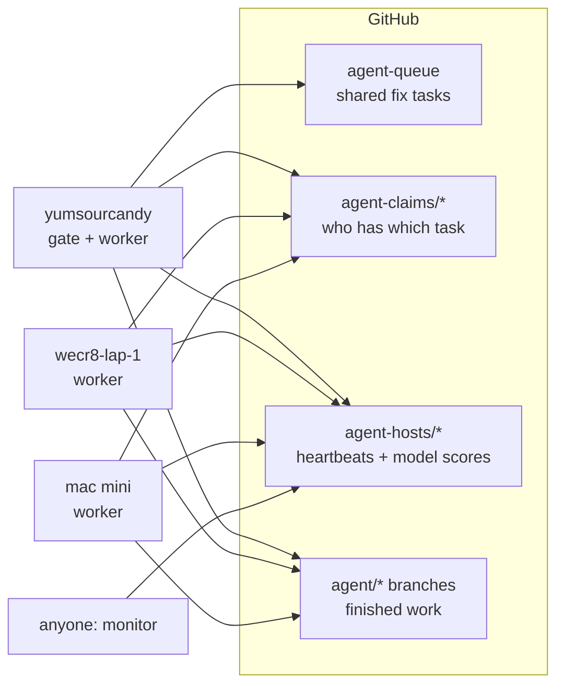

# Running overnight on several computers

This is the runbook for running the agent loop unattended on the shop's
computers (yumsourcandy, wecr8-lap-1 and the Mac mini). It keeps them working
through the night and lets anyone, including a Claude Code cloud session,
watch them through GitHub without opening any ports.

## How the pieces fit



- One computer runs the **gate** (the repo's checks) every 15 minutes. It
  turns failures and findings into fix tasks on the `agent-queue` branch.
- Every computer runs **workers**. They claim tasks through `agent-claims/*` branches,
  so no task runs twice, and push finished branches as `agent/<id>` for a
  person to review.
- Every computer pushes a **heartbeat** every 5 minutes: what it is doing,
  task counts, the gate result, free disk, which model servers answer, and its
  model scoreboard.
- Nothing is merged automatically.

## Set up each computer (once)

Do this in each repository you want worked on (`jobline.ai-g-code`,
`jobline.ai-CAM`, `shift-handover-hub`), on each computer. Each repository
has its own queue, claims and heartbeats on its own remote, so a computer can
run one, two or all three.

1. Clone the repo, check out the branch to work on, and run `npm ci`. For CAM,
   also run `npx playwright install chromium`, or set
   `PLAYWRIGHT_CHROMIUM_EXECUTABLE`.
2. Make sure `git push` works without a prompt (credential manager or SSH key).
   Heartbeats and claims are pushes.
3. Copy `tools/agent-loop/supervisor/host.env.example` to `.agent-loop/host.env`
   and set at least:

   | Setting | yumsourcandy | wecr8-lap-1 | mac mini |
   | --- | --- | --- | --- |
   | `JOBLINE_AGENT_HOST` | `yumsourcandy` | `wecr8-lap-1` | `mac-mini` |
   | `JOBLINE_AGENT_QUEUE` | `git` | `git` | `git` |
   | `JOBLINE_AGENT_GATE` | `1` (the one gate) | `0` | `0` |
   | `JOBLINE_AGENT_TAGS` | e.g. `gpu,lmstudio` | e.g. `vscode` | e.g. `lmstudio` |
   | `LMSTUDIO_HOSTS` | its own LM Studio | any LM Studio it can reach | its own LM Studio |

   The roles above are a suggestion: put the gate on the computer that's
   most reliably on all night. A computer without its own GPU can use another
   one's LM Studio by listing it in `LMSTUDIO_HOSTS`, as long as that LM Studio
   is set to serve on the local network.
4. In LM Studio: load a coding model (or enable Just-in-Time loading) and
   start the server (Developer tab). Use the model name in `LMSTUDIO_MODEL`.
5. Run the preflight check and fix anything marked ✗:

   ```bash
   node tools/agent-loop/cli.mjs doctor
   ```

## Start, stop, and start at login

| | macOS / Linux | Windows |
| --- | --- | --- |
| Start now | `tools/agent-loop/supervisor/start.sh` | `powershell -ExecutionPolicy Bypass -File tools\agent-loop\supervisor\start.ps1` |
| Stop | `tools/agent-loop/supervisor/stop.sh` | `powershell -File tools\agent-loop\supervisor\stop.ps1` |
| Start at login | `tools/agent-loop/supervisor/install-macos-launchd.sh` | `powershell -ExecutionPolicy Bypass -File tools\agent-loop\supervisor\install-windows-task.ps1` |

The supervisor:
- keeps the computer awake while it runs (`caffeinate` on a Mac, the Windows
  execution-state API on a PC)
- runs `doctor` first
- restarts the loop after a crash, waiting longer each time (30 s up to 15 min)
- every `JOBLINE_AGENT_RESTART_EVERY` (default 3 h), lets running tasks
  finish, runs `git pull --ff-only` (and `npm ci` if dependencies changed), and
  restarts, so fixes merged during the night are picked up
- stops at `JOBLINE_AGENT_UNTIL` (e.g. `06:30`) if set
- logs to `.agent-loop/logs/`

Laptops: keep them on power with the lid open (or set "do nothing when lid is
closed"). Sleep pauses the loop; leases bring the work back afterwards, but
nothing gets done while asleep.

## Watching

From any clone, on any computer or in the cloud:

```bash
node tools/agent-loop/cli.mjs monitor          # every computer: OK / LOOK / DOWN
node tools/agent-loop/cli.mjs monitor --watch  # refresh every minute
node tools/agent-loop/cli.mjs monitor --json   # for scripts and check-ins
node tools/agent-loop/cli.mjs stats --all-hosts  # which models are working
```

A computer is **DOWN** after three missed heartbeats (15 minutes by default).
**LOOK** means it is running but something needs a person: the gate is
failing, a task is blocked, disk is under 5 GB, or a model server keeps
failing. The exit code is non-zero if any computer isn't OK.

## Learning which models work

Every attempt is recorded with the provider, the model, the task's role and
the outcome. `stats` shows, per model:
- the pass rate
- how often its reply couldn't be used at all (no diff, a diff that didn't
  apply, or paths it may not touch)
- its median time
- how many tasks it finished

`monitor` merges these across computers. To route by results instead of
config order, set `"adaptive": true` on a role. The loop then tries its
providers in order of measured success. A provider with fewer than six
attempts keeps its place, so new models still get tried.

To compare two models fairly, run both on similar tasks for a night or two
(for example LM Studio with one model on yumsourcandy and another on the Mac
mini), then read `stats --all-hosts`.

## Morning review

1. Run `monitor`: all OK? If any computer is LOOK or DOWN, its problems are
   listed.
2. Run `git fetch` and look at the `agent/*` branches. Each has a report at
   `.agent-loop/reports/<id>.md` on the computer that did it. Review the diffs
   (code plus any refreshed baselines) and merge the good ones.
3. Blocked tasks: read the report. Then fix the task text, reset it
   (`cli.mjs reset <id>`), or do it by hand.
4. Run `stats --all-hosts`, and move the best model to the front of the roles,
   or turn on `adaptive`.
