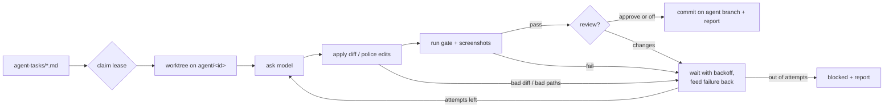

# JobLine agent loop

A reusable harness that lets many coding agents (local models, Claude, or any
CLI agent) work on queued tasks in parallel. Each agent develops, gets checked,
and is corrected until its change passes, and nothing is merged without a
person. The same folder is used in `jobline.ai-g-code` and `jobline.ai-CAM`;
only `agent-loop.config.json` and `agent-tasks/` differ between them.

It needs Node 20 or later and git. Nothing else is required unless you use the
Claude API provider, which loads `@anthropic-ai/sdk`.

## Quick start

```bash
npm run agent -- providers          # which models are reachable
npm run agent -- new "Cover decimal travel input" --role test
# edit agent-tasks/cover-decimal-travel-input.md: instructions + files
npm run agent:run                   # work the queue, then stop
npm run agent:status                # what happened (add --watch for a live view)
git log agent/cover-decimal-travel-input   # review, then merge like any branch
```

## How a task runs



- **Isolation.** Every task gets its own git worktree under `.agent-loop/worktrees/`
  and its own branch `agent/<id>`. The main checkout is never touched. Worktrees
  share the main `node_modules` through a link, so a flood of agents doesn't
  run a flood of installs.
- **Models never run commands.** In `diff` mode a model returns a unified
  diff. The harness checks every path in it against `edits.allow`/`edits.deny`
  and applies it with `git apply --recount`, which repairs the wrong hunk counts
  small models often write. In `agentic` mode (Claude Code CLI, aider and
  similar) the agent edits the worktree itself, and the harness reverts anything
  outside the allowed paths before running checks. Checks only come from the
  config. The harness, the config, `.git`, `.github`, `node_modules` and
  `.env`/key files can never be changed.
- **Correction.** A failed check's name and output tail go into the next
  prompt, along with the change so far. Prompts tell the model not to weaken
  tests.
- **Escalation.** A role lists providers in order, e.g. `["local", "claude"]`
  with `escalateAfter: 2`: two tries on the free local model, then the stronger
  one.
- **Review.** With `review: true` (per task or in `task.review`), a reviewer
  model sees the final diff and the screenshots, and must answer
  `VERDICT: APPROVE`. Anything else is treated as changes requested and fed back.
- **Reports.** `.agent-loop/reports/<id>.md` has one row per attempt.
  `.agent-loop/events.jsonl` logs every step for dashboards or `tail -f`.

## Waits and pacing

| Setting | Default | What it controls |
| --- | --- | --- |
| `waits.betweenAttempts` | 20s → 10m | Exponential backoff with jitter between a task's attempts, so a flood that fails together doesn't retry together |
| `waits.providerRetry` | 5s → 5m, 5 retries | Retries on 429/5xx/connection errors. A server's `Retry-After` always wins if it's longer |
| `providers.<n>.requestsPerMinute` | none | Rolling one-minute cap per provider |
| `providers.<n>.minInterval` | 0 | Minimum gap between requests to one provider |
| `providers.<n>.concurrency` | 2 | Requests in flight per provider (set `1` for a single local GPU) |
| `concurrency` | 3 | Tasks worked at once |
| `checkConcurrency` | 2 | Gate runs at once across all agents, so ten agents don't all run `npm test` together |
| `checks.<n>.timeout` | 10m | The process tree is killed past this |
| `waits.lease` | 45m | A crashed worker's task returns to the queue after this |
| `waits.poll` | 30s | How often `run --watch` looks for new or newly unblocked tasks |
| `waits.gateInterval` | 15m | Interval for `gate --watch` (the CI loop) |

Ctrl+C stops cleanly: running tasks go back to pending and resume at their
next attempt on the next run. A second Ctrl+C exits immediately. Each kind of
loop (`run`, `gate`) takes a lock, so two copies can't run at once in the same
checkout.

## Providers

| `type` | For | Mode | Notes |
| --- | --- | --- | --- |
| `ollama` | Local models (Qwen coder, Llama, etc.) | diff | `host`, `model`, `contextTokens`; set `vision: true` for a vision model used as reviewer |
| `openai` | LM Studio, llama.cpp server, vLLM, OpenRouter, any OpenAI-compatible gateway | diff | `baseUrl`, `model`, `apiKeyEnv` |
| `anthropic` | Claude API | diff | Install `@anthropic-ai/sdk` and set `model` (the config reads `JOBLINE_AGENT_CLAUDE_MODEL`). `effort`, `maxTokens`, `vision`. Server-side refusal fallback is on unless `"fallbacks": false` |
| `claude-code` | Claude Code CLI, headless | agentic | Uses your `claude` login. `allowedTools` defaults to file tools only, with no shell |
| `command` | Anything else (aider, a codex wrapper, your own script) | `diff` or `agentic` | `run` gets the prompt on stdin, or as a file via `{promptFile}` |

Only tasks whose role reaches a provider ever call it, so a machine with only
Ollama works with the default config until a task escalates.

## Screenshots

Mark a check with `"screenshots": true` and `"screenshotDirs": [...]`. Images
that check writes are copied to `.agent-loop/artifacts/<task>/attempt-N/` and
handed to a vision-capable reviewer. In this repo the `visual` check wraps
`npm run test:e2e:visual` (VS Code webview captures). In CAM it wraps the
Playwright e2e specs.

## The CI loop

`npm run agent:gate` runs the configured gate once on the main checkout.
`npm run agent:gate -- --watch` repeats it every `waits.gateInterval` (it
replaces CAM's old `ci-automation-loop.cjs`). Results go into `state.json` and
show in `status`.

## Commands

```
run [--watch] [--only a,b] [--concurrency N]   work the queue
gate [--watch] [--checks a,b]                  run checks on the main checkout
status [--watch]                               tasks, gate result, recent events
new "Title" [--role develop|test|fix]          scaffold a task file
providers                                      reachability of each provider
reset [id] [--remove-worktree] [--delete-branch]  forget state so a task runs again
```

All commands take `--root <dir>` and `--config <file>`.

## Writing a good task

```markdown
---
id: preset-travel-tests        # branch becomes agent/preset-travel-tests
title: Cover more machine travel input formats
role: test                     # develop | test | fix, or any role in the config
files: [src/presets/presetLibrary.ts, test/machine-presets.test.ts]   # paths or globs shown to the model
checks: [typecheck, unit]      # defaults to the config's gate
maxAttempts: 4
review: true                   # optional reviewer pass
dependsOn: [other-task]        # wait for another task to finish
priority: 10                   # higher runs first
enabled: false                 # park it
---
What to change, what "done" means, and what must not change.
```

Keep tasks small. One behaviour per task lets a local model finish it and
keeps each branch easy to review. List the files the change needs; anything
not listed is invisible to `diff`-mode models.

## Tests

`npm run test:agent-loop` covers waits, pacing, locks, leases, parsing and
path safety. It also runs four end-to-end loops in scratch git repos with
scripted models: fail then fix with escalation and review, refused paths, an
agentic CLI provider, and the CI gate.
